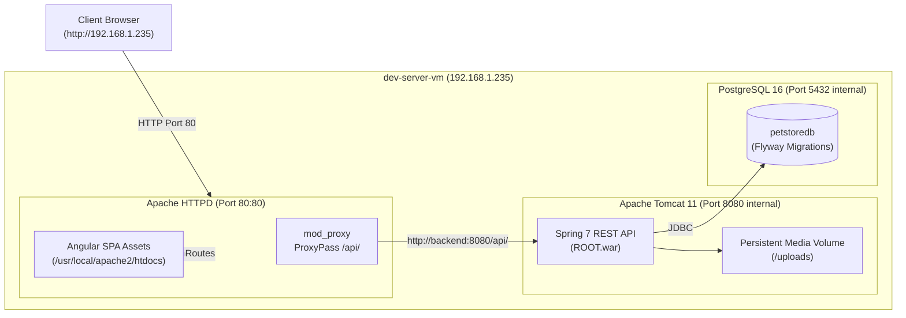
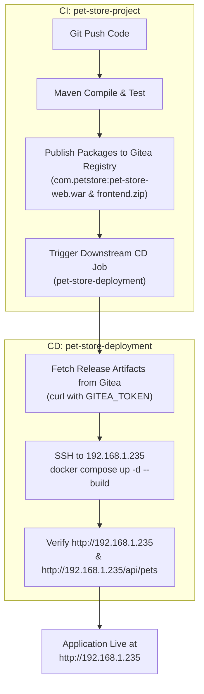

# Pet Store - Continuous Deployment & Docker Environment

This repository hosts the **Continuous Deployment (CD)** pipelines, Docker container definitions, reverse-proxy configurations, and orchestration scripts for running the Pet Store application on **`dev-server-vm` (`192.168.1.235`)**.

---

## 🏛 System Architecture



### Container Services

| Service | Base Image | Role | Port | Volumes |
| :--- | :--- | :--- | :--- | :--- |
| **`frontend`** | `httpd:2.4-alpine` | Serves Angular SPA bundle, handles HTML5 pushState routing, reverse-proxies `/api/*` to Tomcat | `80:80` | None |
| **`backend`** | `tomcat:11.0-jdk21-temurin` | Pure Spring 7 REST API (`ROOT.war`), executes Flyway DB migrations automatically on startup | `8080` (internal) | `uploads_data:/uploads` |
| **`db`** | `postgres:16-alpine` | PostgreSQL 16 database | `5432` (internal) | `postgres_data:/var/lib/postgresql/data` |

---

## 🔄 Decoupled CI/CD Workflow

The application code lifecycle is cleanly decoupled across two repositories:



1. **`pet-store-project` (CI)**: Builds Java 21 Spring backend and Angular frontend, runs test suites, stamps the release version, and publishes packages into the **Gitea Maven Package Registry** (`http://192.168.1.233/api/packages/DevHome/maven`).
2. **`pet-store-deployment` (CD)**: Takes a target version (`RELEASE_VERSION`), pulls the exact immutable `.war` and `.zip` packages from Gitea, transfers configs to `192.168.1.235`, and orchestrates container upgrades.

---

## 💻 Repository Setup & Git Initial Push

To commit and push this repository to your Gitea server:

```powershell
# In PowerShell / Terminal:
cd F:\Dev\git\pet-store-deployment
git add .
git commit -m "feat: initial commit for pet-store-deployment stack"

# Add Gitea remote (replace with your repo URL if different):
git remote add origin ssh://git@192.168.1.233:2222/adrian/pet-store-deployment.git
git push -u origin master
```

---

## 🚀 One-Time Setup for dev-server-vm (`192.168.1.235`)

### Step 1: Run the Automated VM Initialization Script
Log in to `192.168.1.235` and run the script as root/sudo:

```bash
# If copying from workstation:
scp scripts/init-dev-server.sh <user>@192.168.1.235:/tmp/
ssh <user>@192.168.1.235 "sudo bash /tmp/init-dev-server.sh"
```

**What this script automates:**
* Installs **Docker Engine** & the **Docker Compose plugin** (`docker compose`).
* Enables and starts the Docker daemon on boot (`systemctl enable --now docker`).
* Creates a dedicated deployment user: **`jenkins`** (home: `/home/jenkins`).
* Adds `jenkins` to the **`docker` group** so Docker commands run passwordlessly without `sudo`.
* Prepares `/home/jenkins/.ssh` with secure permissions (`700` directory, `600` authorized_keys).
* Creates `/opt/petstore` owned by `jenkins:docker` (`775` permissions).
* Opens firewall ports: **`22`** (SSH) and **`80`** (HTTP).

---

### Step 2: Configure SSH Key Access for Jenkins

Jenkins connects to `192.168.1.235` as user `jenkins` using an SSH key pair.

#### 1. Generate SSH Key on your Workstation:
In **PowerShell**:
```powershell
ssh-keygen -t ed25519 -C "jenkins-deploy@dev-server-vm" -f "$HOME\.ssh\id_ed25519_jenkins_devserver" -N '""'
```

This creates:
* `id_ed25519_jenkins_devserver` (Private key — Goes into Jenkins)
* `id_ed25519_jenkins_devserver.pub` (Public key — Goes onto `192.168.1.235`)

#### 2. Authorize Public Key on `dev-server-vm`:
On `dev-server-vm` (`192.168.1.235`), add the public key to `/home/jenkins/.ssh/authorized_keys`:
```bash
sudo su - jenkins -c "mkdir -p ~/.ssh && chmod 700 ~/.ssh && touch ~/.ssh/authorized_keys && chmod 600 ~/.ssh/authorized_keys"

# Paste your public key content:
sudo su - jenkins -c "echo '<PASTE_PUBLIC_KEY_CONTENT>' >> ~/.ssh/authorized_keys"
```

#### 3. Verify Connection from Workstation:
```powershell
ssh -i "$HOME\.ssh\id_ed25519_jenkins_devserver" jenkins@192.168.1.235 "docker compose version"
```
*Expected output: `Docker Compose version v2.x.x`*

---

### Step 3: Add Credentials to Jenkins

In Jenkins Dashboard > **Manage Jenkins** > **Credentials** > **System** > **Global credentials (unrestricted)**:

| Credential Type | ID | Description | Values |
| :--- | :--- | :--- | :--- |
| **SSH Username with private key** | `dev-server-ssh-key` | SSH key for dev-server-vm | Username: `jenkins`<br>Private Key: Paste `id_ed25519_jenkins_devserver` |
| **Secret text** | `gitea-token` | Gitea PAT for package registry | Secret: Gitea Personal Access Token (with `package` read scope) |

---

## 🛠 Jenkins CD Pipeline Setup

1. In Jenkins, click **New Item** > Enter Name: **`pet-store-deployment`** > Select **Pipeline** > Click **OK**.
2. Under **Build Triggers**, optionally enable **Trigger builds remotely** or trigger from upstream.
3. Under **Pipeline**:
   - **Definition**: `Pipeline script from SCM`
   - **SCM**: `Git`
   - **Repository URL**: `ssh://git@192.168.1.233:2222/adrian/pet-store-deployment.git`
   - **Credentials**: `gitea-ssh-key`
   - **Branch Specifier**: `*/master`
   - **Script Path**: `Jenkinsfile`
4. Click **Save**.

---

## 🔄 Deployment Workflows

### Option A: Jenkins CD Pipeline (Recommended)
1. Navigate to the `pet-store-deployment` job in Jenkins.
2. Click **Build with Parameters**:
   - `RELEASE_VERSION`: e.g. `1.0.1-RELEASE` (or any historical version)
   - `TARGET_HOST`: `192.168.1.235`
3. Click **Build**. The pipeline will download artifacts, deploy containers, and run smoke tests.

### Option B: Instant Rollback
To roll back to any previous release version in seconds:
1. Click **Build with Parameters** in Jenkins.
2. Enter the older stable version, e.g. `1.0.0-RELEASE`.
3. Click **Build**. In under 15 seconds, the containers will be re-built and running the stable version.

### Option C: Manual CLI Deployment on dev-server-vm
On `dev-server-vm` (`192.168.1.235`):
```bash
cd /opt/petstore
./scripts/deploy.sh --gitea --version 1.0.1-RELEASE --token <YOUR_GITEA_TOKEN>
```

---

## 🌐 Application Verification & Endpoints

Once deployed, access the application from any device on your local network:

* **Frontend Angular SPA**: [http://192.168.1.235](http://192.168.1.235)
* **Backend REST API**: [http://192.168.1.235/api/pets](http://192.168.1.235/api/pets)
* **Default Seeded Admin Account**:
  - **Username**: `admin` (or `admin@petstore.com`)
  - **Password**: `Admin@123`

---

## 🔍 Useful Operational Commands (on 192.168.1.235)

```bash
cd /opt/petstore

# Check container status
docker compose ps

# View live backend Tomcat logs
docker compose logs -f backend

# View live frontend Apache HTTPD logs
docker compose logs -f frontend

# Restart services
docker compose restart

# Stop all containers
docker compose down

# Stop and wipe database volume (clean state reset)
docker compose down -v
```
